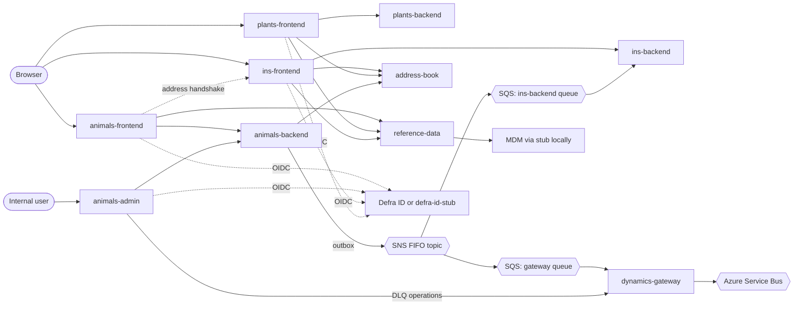

# Architecture overview

How the trade imports services fit together and what each is responsible for.
Per-repo detail (stack, ports, how to run) is in the sibling pages; the repo map
with roles is in the root [`CLAUDE.md`](../../CLAUDE.md). This page is about the
**boundaries between services**: who calls whom, and who owns which data.

Everything here was checked against the repos. Where a link is unproven the
per-repo page says "Unclear from code".

## The three journeys

| Journey | Frontend | Backend | Notes |
|---|---|---|---|
| Live animals | `trade-imports-animals-frontend` | `trade-imports-animals-backend` | The most complete journey; the only one with an outbox to PIMS. |
| High-risk plants | `trade-imports-plants-frontend` | `trade-imports-plants-backend` | Persists notifications only. No outbox, no gateway. |
| Cross-journey view (INS) | `trade-imports-ins-frontend` | `trade-imports-ins-backend` | Read model over notification events, plus the address-book UI. |

`trade-imports-animals-admin` is the internal admin UI for the animals service.

## Service map

## Responsibilities at a glance

| Service | Owns | Does not own |
|---|---|---|
| animals-frontend | Live-animals UI, journey flow, validation, session | Persistence, reference data, addresses |
| animals-backend | Animals notification aggregate and lifecycle, audit trail, the outbox and its publishing | UI, reference data, address records |
| animals-admin | Internal views over notifications, DLQ operator UI | Business rules (delegates to backend and gateway) |
| plants-frontend | High-risk plants UI, journey flow, validation, session | Persistence, reference data, addresses |
| plants-backend | Plants notification aggregate and lifecycle, reference numbers, audit | Outbox, PIMS routing, identity |
| ins-frontend | Sign-in front door, notifications dashboard, address-book UI (a backend-for-frontend) | Any database |
| ins-backend | Cross-journey notification read model, built from events | Writes to notifications; it is read-only over REST |
| address-book | Organisation-scoped address records (system of record) | Authentication; trusts the `Trade-Imports-Organisation-Id` header |
| reference-data | Read API for countries and ports of entry, MDM token handling, caching | Holding data itself; it fetches from MDM |
| dynamics-gateway | Forwarding submitted and amended notification events to Azure Service Bus; DLQ operator API | Any database; retries rely on SQS redelivery |
| schemas | JSON Schema and JSON-LD contracts for payloads | Runtime enforcement; consumers reference it, not depend on it |
| stub | Fake Trade platform token endpoint and MDM countries and ports | Any real logic |
| defra-id-stub | Fake Defra ID OIDC sign-in | Real identity; still a work in progress |
| animals-tests | End-to-end tests for the stack | Application code |

## Data flows worth knowing

**Notification submission (animals).** The animals frontend calls the animals
backend. The backend writes the notification and an outbox event together. A
poller publishes outbox events to an SNS FIFO topic, with the aggregate id as the
message group so events for one notification stay in order.

**Fan-out from the topic.** Two SQS FIFO queues subscribe:

- The **gateway** queue. The gateway forwards only `NotificationSubmitted` and
  `NotificationSubmissionAmended`, mapped to a `PimsEventV1` payload, to an Azure
  Service Bus session queue. Other event types are dropped.
- The **ins-backend** queue. ins-backend upserts a flattened summary per
  notification into its own Mongo collection, guarded by `aggregateVersion`.

**The gateway is not called by the backend.** The backend has no gateway client;
the only path is SNS then SQS. The gateway's `POST /events` is a diagnostic
endpoint. The admin service does call the gateway, but only for dead-letter queue
operations (list, replay-all, delete-all).

**Addresses.** address-book is the only owner of address records. ins-frontend
and plants-frontend call it directly. The animals backend calls it through
`AddressBookClient`. The animals frontend sends the user to ins-frontend for
address management and back again (the handshake, journey type `gbn-ag` only).

**Reference data.** Frontends call reference-data for countries and ports of
entry. reference-data calls MDM, which locally is `trade-imports-stub`. The
animals backend does not use it.

**Sign-in.** The four UIs use Defra ID OIDC, or `trade-imports-defra-id-stub`
locally. Sessions live in Redis.

## Target direction

The sections above describe the code **as it is today**. This section records the
intended direction, stated by the team, and is not yet reflected in the code.

- **No repositories are being removed or replaced.**
- **The INS is the front door for all journeys.** Eventually a trader answers a
  few routing questions in the INS, which sends them to the right journey to
  create an import.
- **The journeys stay separate services** (animals, plants, and any later ones)
  behind the INS.
- **The INS owns the capabilities shared across journeys.** The dashboard and the
  address book stay in the INS. Anything used by more than one journey belongs
  there rather than being rebuilt in each journey.
- **Journeys may call the address-book API, but must not build their own
  address-book screens.** A journey can read and write addresses through the
  address-book API (for example to offer a saved address in a form). Any screen
  for managing addresses (list, add, edit, delete) belongs in `ins-frontend`, and
  a journey that needs one sends the user there, as the animals frontend does
  with the address handshake.

What this means for agents working today: put new cross-journey behaviour in the
INS repos (`ins-frontend`, `ins-backend`, `address-book`), not in a single
journey's frontend or backend. Do not add address-management pages to a journey
frontend. Where today's code differs from this direction (for example the routing
questions not existing yet), treat the code as the current state, not as the
pattern to copy.

## Known gaps and inconsistencies

- Who consumes the Azure Service Bus queue (Dynamics or PIMS) is not visible in
  any repo here.
- plants-backend publishes nothing, so plants notifications never reach the INS
  read model or PIMS. That may be intended while the journey is built.
- ins-backend and address-book have no authentication layer in code; they rely
  on the caller and CDP ingress.
- `trade-imports-plants-prototype` is not cloned in the workspace, so its page is
  thin.
- `trade-imports-stub` and `reference-data` configure Mongo but no code uses it.

Related: [`README.md`](README.md) in this folder for the per-repo pages,
[`../local-setup.md`](../local-setup.md) for running the stack.
