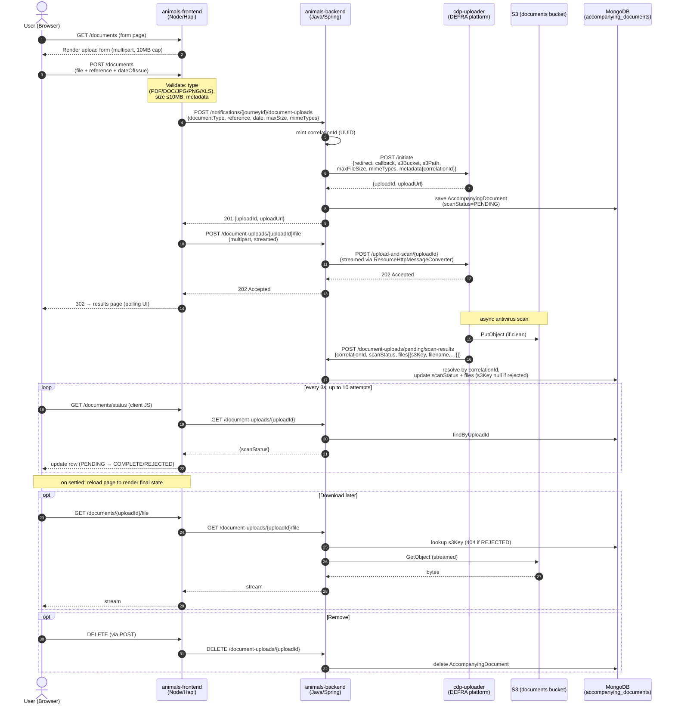

# Live-animals document upload flow

End-to-end sequence for the accompanying-documents journey in
`trade-imports-animals-frontend` → `trade-imports-animals-backend`
→ CDP Uploader → S3.

## Key details

- **Two IDs.** `uploadId` (minted by cdp-uploader, used for all user-facing
  routes) and `correlationId` (minted by the backend, embedded in cdp
  metadata so the async scan callback can find the document even before
  the uploadId is fully persisted). See `DocumentService.initiate()`
  (`repos/trade-imports-animals-backend/src/main/java/uk/gov/defra/trade/imports/animals/accompanyingdocument/DocumentService.java:79-106`)
  and `handleScanResult()` (`:150-159`).
- **Streaming, not buffering.** Both frontend→backend and backend→cdp-uploader
  legs stream the multipart body — Hapi has `payload.output: 'stream'`
  on the route
  (`repos/trade-imports-animals-frontend/src/server/app/sets/live-animals/journeys/linear/features/documents/controller.js:308-318`),
  and the backend uses `ResourceHttpMessageConverter` in
  `CdpUploaderClient.uploadFile()`
  (`repos/trade-imports-animals-backend/src/main/java/uk/gov/defra/trade/imports/animals/cdp/uploader/CdpUploaderClient.java:95-116`)
  so a 10MB file never sits in the JVM heap.
- **Scan is fully asynchronous.** The `/file` POST returns 202
  immediately; final status arrives via the `scan-results` callback.
  Frontend polls `/documents/status` every 3s (10 attempts max) — see
  `.../documents/client/scan-status/poll.js` and `scan-poll.js`.
- **REJECTED files have no `s3Key`.** The download route returns 404
  rather than streaming a quarantined file
  (`DocumentService.findFile()` `:220-232`).
