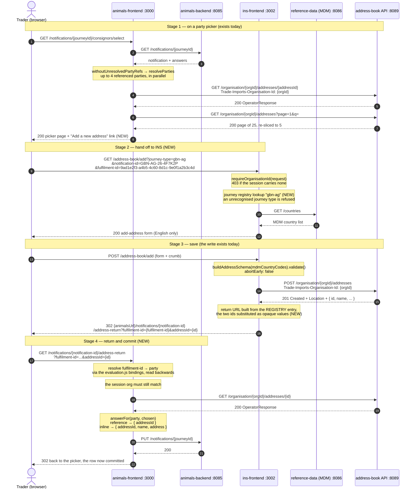
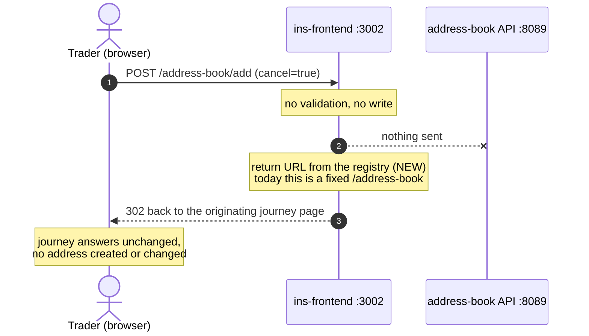
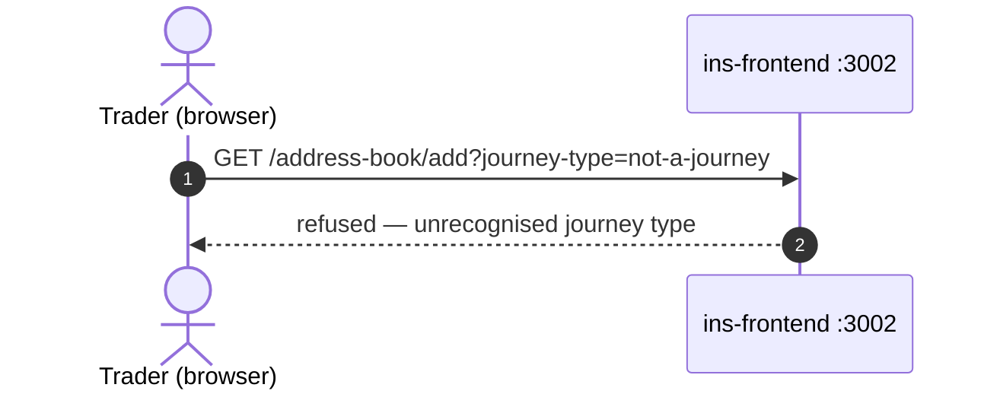

# EUDPA-333 — the add-an-address handshake, in sequence

Traces the whole loop: a Trader on a live-animals party picker, out to the INS
address book form, the write to the address book API, and back into the journey
with the record committed against the party they were completing.

Steps marked **NEW** are what EUDPA-333 adds. Everything else is on `main` today,
built by EUDPA-294. See [`ticket.md`](ticket.md) for the ticket itself.

Ports are the local stack (`docker/stack/frontend.compose.yml`).

---

## 1. The happy path

Only the `id` crosses back — AC: *"the return carries the identifier of the saved
address book record only, not the address fields."* Stage 4 reads the record back
rather than trusting anything on the query string.

## 2. Leaving without saving

## 3. The guard

Settled 26 Aug: INS builds the return URL from its own registry entry, so nothing
path-like is ever sent. There is one guard, not three.

An earlier draft of this page showed INS rejecting a return path carrying a scheme
(`https://evil.example`) or a leading `//`. Those rows are gone deliberately: under
the settled design no return path is accepted, so there is no sanitiser and no
bypass to attempt. The origin and the route shape both come from the registry; the
request supplies only a journey type and two opaque ids. The class of bug is
designed out rather than filtered — a distinction the ticket previously stated and
then undercut by describing the filter.

---

## The six entry points

Five parties share one controller and one template, registered by flatMap over
`PARTIES` (`party-picker.controller.js:125-138`, list at `parties.js:20-57`):

| Party | Route | Holds |
|---|---|---|
| `placeOfOrigin` | `/notifications/{journeyId}/place-of-origin/select` | copy (`inline: true`) |
| `consignor` | `/notifications/{journeyId}/consignors/select` | reference |
| `consignee` | `/notifications/{journeyId}/consignees/select` | reference |
| `importer` | `/notifications/{journeyId}/importers/select` | reference |
| `placeOfDestination` | `/notifications/{journeyId}/destinations/select` | reference |
| `contactAddress` | `/notifications/{journeyId}/consignment/contact/select` | copy (`inline: true`) |

The consignment contact is **not** one of the five — it has its own controller
(`contact/controller.js:119`) and renders a plain radio list rather than the
paginated picker, deliberately excluded from `PARTIES` (`parties.js:59-70`).

`answerFor` (`selection.js:29-36`) already handles both shapes, which is why the
return should route through it rather than writing an answer by hand.

---

## Checked against the code — six things to settle

Every claim below was read in the repo, not inferred from the ticket.

**1. `TRADE_IMPORTS_ADDRESS_BOOK_URL` is not a convict entry in animals.** It is
read bare off `process.env` with an inline fallback
(`services/address-book/client.js:8`). Only `tradeImportsAnimalsBackendApi` and
`tradeImportsReferenceDataApi` are registered (`config.js:334-349`). So the tech
note's *"following the `TRADE_IMPORTS_*_URL` pattern already in those files"*
describes a pattern the address-book URL itself does not follow, and
`config.validate({ allowed: 'strict' })` never sees it. Either the new INS-URL
setting is the first of its kind in that repo, or this tidy-up rides along.
Matters because the AC requires the service to *"fail to start when the location
it needs is missing or malformed"* — a bare `process.env` read cannot do that.

**2. ~~The registry contract is stated two ways.~~ SETTLED 26 Aug.** The prose said
animals sends *"a journey key and a relative path"* and told the implementer to
sanitise that path, while the worked example carried no path at all — two designs
in one paragraph, the second undercutting the first's claim that the bug class was
"designed out rather than filtered".

Resolved in favour of component parts, and pushed to the ticket: animals sends a
journey type plus `notification-id` and `fulfilment-id`; INS looks the type up in
its registry and builds the whole URL, substituting the two ids as opaque values.
The journey type is `gbn-ag` — the notification-reference prefix denoting the live
animals import from the EU, a domain term that outlives any service rename. It
overlaps the reference number by design, but INS must not derive one from the
other: parsing the reference would couple INS to a format the animals backend
owns.
The registry holds one entry per journey type, not one per obligation, and animals
gains a single `address-return` route that resolves the obligation id to a party.
Obligation ids are UUIDs, so opacity is a property of the data rather than a rule
someone must remember.

**3. "All six entry points" means two surfaces.** See the table above. Sizing
should assume both the shared picker and the contact controller/template.

**4. Cancel would 403 before it could return the Trader.**
`requireOrganisationId` runs at `controller.js:94`, *before* the cancel check at
`controller.js:96-98`. A session with no organisation gets `Boom.forbidden`
rather than being returned to where they came from, against the "leaving without
saving" AC.

**5. `?selected=` already exists, and only pre-ticks.** The picker GET reads
`request.query.selected` (`party-picker.controller.js:64-67`) purely to pre-check
a row — it commits nothing. Reusing that parameter for the return would look
right and leave the answer unsaved. The return needs its own handler going
through `answerFor` + `state.commit`, exactly as the tech notes say.

**6. A ruling on the EUDPA-294 doc may contradict the org-identity note.**
[`../eudpa-294-address-book-link/discussion.md`](../eudpa-294-address-book-link/discussion.md)
records *"RULING (Sam, meeting) — rip out the org scoping … everyone has access to
everything"*. That never landed: `organisationIdOf` still reads the session
(`organisation-id.js:14-15`) and the client still throws without an organisation
(`client.js:22-27`). EUDPA-333's tech note matches the code, not the ruling.
Confirm the ruling is dead before building the org-match check on return.

---

## Also worth knowing

- **The create response already carries the id.** The address book returns `201
  Created`, a `Location` header and an `OperatorResponse` whose first field is the
  opaque `id` (`OperatorController.java:144,187-200`,
  `OperatorResponse.java:24-27`). INS currently reads only `.name` from it, for
  the success banner (`controller.js:133-137`).
- **No return concept exists in INS today.** A grep for
  `returnTo|return_to|journey` across `src/server/address-book` returns nothing;
  both success and cancel redirect to a hardcoded `/address-book`
  (`controller.js:97,139`).
- **The compose file confirms the browser-vs-internal warning.** Every
  `TRADE_IMPORTS_*_URL` in `docker/stack/frontend.compose.yml` today is
  `http://host.docker.internal:{port}` — server-to-server. The two new settings
  must be `http://localhost:3000` and `http://localhost:3002` instead, or the
  redirect passes a container health check and breaks in a browser.
- **Stub mode.** `isStubMode()` is `config.get('stubMode') && !config.get('isProduction')`
  (`common/services/mode.js:13-14`); in that mode `party(orgId, id)` searches
  `STUB_BOOK` and ignores the organisation entirely
  (`services/address-book/index.js:127-132`). INS is not running, so the add link
  must be hidden or inert.
